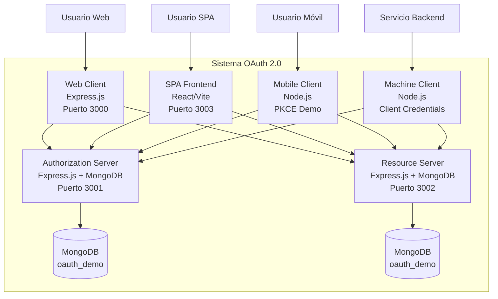
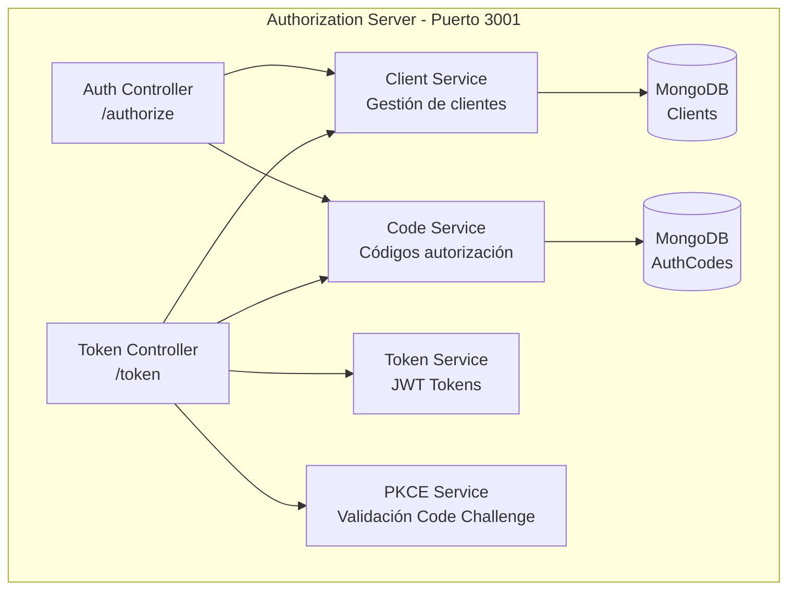

# 🔐 OAuth 2.0 Implementation Project - Complete Demo

Una implementación completa y educativa de todos los flujos OAuth 2.0, diseñada para explicar y demostrar los conceptos de autorización moderna.

## 📋 Tabla de Contenidos

- [Descripción](#-descripción)
- [Arquitectura](#-arquitectura)
- [Flujos Implementados](#-flujos-implementados)
- [Requisitos](#-requisitos)
- [Instalación](#-instalación)
- [Configuración](#-configuración)
- [Uso](#-uso)
- [Estructura del Proyecto](#-estructura-del-proyecto)
- [Endpoints API](#-endpoints-api)
- [Seguridad](#-seguridad)
- [Demostraciones](#-demostraciones)
- [Troubleshooting](#-troubleshooting)
- [Contribución](#-contribución)
- [Licencia](#-licencia)

## 🎯 Descripción

Este proyecto implementa **todos los flujos OAuth 2.0** definidos en el RFC 6749, proporcionando una plataforma educativa completa para entender:

- Autorización delegada segura
- Diferentes tipos de concesión (grant types)
- Mecanismos de seguridad (PKCE, state, scopes)
- Implementación de servidores de autorización y recursos
- Clientes para diferentes escenarios

## 🏗️ Arquitectura

### Diagrama C4 Nivel 2 (Contenedores)



### Diagrama C4 Nivel 3 (Componentes - Authorization Server)



## 🔄 Flujos Implementados

| Flujo | Tipo Cliente | Código | Seguridad | Caso de Uso |
|-------|-------------|---------|-----------|-------------|
| **Authorization Code** | Confidencial | ✅ | 🔐 | Aplicaciones web con backend |
| **Authorization Code + PKCE** | Público | ✅ | 🔐🔐 | SPAs, móviles, desktop |
| **Client Credentials** | Confidencial | ✅ | 🔐 | Machine-to-machine |
| **Refresh Token** | Todos | ✅ | 🔐 | Renovación de tokens |

## ⚙️ Requisitos

### Software Requerido
- **Node.js** 18.0 o superior
- **npm** 9.0 o superior
- **MongoDB** 5.0 o superior

### Dependencias Principales
- Express.js - Servidores web
- MongoDB/Mongoose - Base de datos
- JWT - Tokens de acceso
- bcrypt - Hash de contraseñas
- crypto - Generación PKCE
- axios - Clientes HTTP
- React - SPA Frontend
- Vite - Build tool para React

## 🚀 Instalación

### 1. Clonar el Repositorio
```bash
git clone https://github.com/Pepejsc/OAUTH-2.0.git
cd OAUTH-2.0
```

### 2. Instalar Dependencias
```bash
# Instalar todas las dependencias
npm run install:all

# O individualmente
npm run install:auth
npm run install:resource  
npm run install:web
npm run install:spa
npm run install:mobile
npm run install:machine
```

### 3. Configurar Base de Datos
```bash
# Iniciar MongoDB
mongod --dbpath "C:\data\db"

# Inicializar datos
npm run db:init
```

### 4. Configurar Variables de Entorno
```bash
# Copiar plantillas y configurar
cp .env.example .env
# Configurar cada servicio según sea necesario
```

## 🔧 Configuración

### Variables de Entorno Críticas

**authorization-server/.env**
```env
NODE_ENV=development
PORT=3001
MONGODB_URI=mongodb://localhost:27017/oauth_demo
JWT_SECRET=tu_jwt_secret_super_seguro_aqui
JWT_REFRESH_SECRET=tu_refresh_secret_aqui
```

**resource-server/.env**
```env
NODE_ENV=development
PORT=3002
MONGODB_URI=mongodb://localhost:27017/oauth_demo
JWT_SECRET=tu_jwt_secret_super_seguro_aqui
```

### Configuración de Clientes OAuth

El sistema incluye clientes preconfigurados:

| Client ID | Tipo | Redirect URI | Scopes |
|-----------|------|--------------|---------|
| `web-client-123` | Confidencial | `http://localhost:3000/callback` | `profile email` |
| `mobile-client-456` | Público | `com.oauth.demo://callback` | `profile openid` |
| `machine-client-789` | Confidencial | N/A | `api:read api:write` |

## 🎮 Uso

### 1. Iniciar Todos los Servicios
```bash
# Desarrollo - inicia servicios principales
npm run dev

# O individualmente
npm run dev:auth    # Authorization Server (3001)
npm run dev:resource # Resource Server (3002)
npm run dev:web     # Web Client (3000)
npm run dev:spa     # SPA Frontend (3003)
```

### 2. Acceder a las Demostraciones

| Servicio | URL | Descripción |
|----------|-----|-------------|
| **Web Client** | http://localhost:3000 | Cliente web tradicional |
| **SPA Frontend** | http://localhost:3003 | Aplicación React moderna |
| **Auth Server** | http://localhost:3001 | Servidor de autorización |
| **API Docs** | http://localhost:3001/health | Health checks |

### 3. Probar Flujos Específicos

#### Flujo Web Tradicional
1. Navegar a http://localhost:3000
2. Click "Login with OAuth"
3. Completar flujo de autorización

#### Flujo SPA Moderno
1. Navegar a http://localhost:3003
2. Click "Iniciar Sesión con OAuth 2.0"
3. Experiencia SPA sin recargas

#### Flujo PKCE (Mobile)
```bash
cd mobile-client
npm run demo-pkce
```

#### Flujo Client Credentials
```bash
cd machine-client
npm run demo-machine
```

## 📁 Estructura del Proyecto

```
OAUTH-2.0/
├── 📁 authorization-server/ # Servidor de autorización
│ ├── 📄 package.json
│ ├── 📄 server.js # Servidor principal
│ ├── 📁 models/ # Modelos de MongoDB
│ │ ├── 📄 AuthorizationCode.js
│ │ └── 📄 Client.js
│ ├── 📁 routes/ # Endpoints OAuth
│ │ ├── 📄 auth.js # /authorize
│ │ └── 📄 token.js # /token
│ ├── 📁 scripts/ # Scripts de inicialización
│ │ ├── 📄 addClientCredentials.js
│ │ ├── 📄 addMachineClient.js
│ │ ├── 📄 addSpaClient.js
│ │ ├── 📄 initData.js
│ │ ├── 📄 reset.js
│ │ ├── 📄 verifyClients.js
│ │ └── 📄 verifySecrets.js
│ └── 📁 utils/ # Utilidades
│ └── 📄 crypto.js # PKCE utilities
├── 📁 resource-server/ # API protegida
│ ├── 📄 package.json
│ └── 📄 server.js # Servidor de recursos
├── 📁 web-client/ # Cliente web tradicional
│ ├── 📄 package.json
│ ├── 📄 server.js # Servidor Express
│ └── 📁 public/ # Archivos estáticos
│ └── 📄 index.html
├── 📁 spa-frontend/ # SPA React moderno
│ ├── 📄 package.json
│ ├── 📄 vite.config.js # Configuración Vite
│ ├── 📄 index.html # Template HTML
│ └── 📁 src/ # Código fuente React
│ ├── 📄 App.jsx # Componente principal
│ ├── 📄 main.jsx # Punto de entrada
│ ├── 📄 App.css # Estilos principales
│ ├── 📄 index.css # Estilos base
│ ├── 📁 components/ # Componentes reutilizables
│ │ ├── 📄 LoadingSpinner.jsx
│ │ └── 📄 Navbar.jsx
│ ├── 📁 contexts/ # Estado global
│ │ └── 📄 AuthContext.jsx
│ ├── 📁 pages/ # Páginas de la aplicación
│ │ ├── 📄 ApiDemo.jsx
│ │ ├── 📄 Callback.jsx
│ │ ├── 📄 Home.jsx
│ │ └── 📄 Profile.jsx
│ └── 📁 services/ # Servicios API
│ └── 📄 authService.js
├── 📁 mobile-client/ # Cliente móvil (PKCE)
│ ├── 📄 package.json
│ └── 📄 demo.js # Demostración PKCE
├── 📁 machine-client/ # Cliente máquina-máquina
│ ├── 📄 package.json
│ └── 📄 demo.js # Demostración Client Credentials
├── 📁 database/ # Scripts de base de datos
│ ├── 📄 package.json
│ └── 📁 scripts/
│ ├── 📄 init.js # Inicialización BD
│ └── 📄 reset.js # Reset BD
├── 📁 docs/ # Documentación
│ └── 📄 package.json
├── 📄 verify-all.js # Script de verificación completa
└── 📄 package.json # Configuración principal
```

## 🌐 Endpoints API

### Authorization Server (3001)

| Método | Endpoint | Descripción |
|--------|----------|-------------|
| `GET` | `/authorize` | Iniciar flujo de autorización |
| `POST` | `/token` | Obtener tokens de acceso |
| `GET` | `/health` | Health check |

### Resource Server (3002)

| Método | Endpoint | Scope Requerido | Descripción |
|--------|----------|-----------------|-------------|
| `GET` | `/api/profile` | `profile` | Perfil de usuario |
| `GET` | `/api/email` | `email` | Email de usuario |
| `GET` | `/api/system/status` | `api:read` | Estado del sistema |
| `GET` | `/api/system/metrics` | `api:read` | Métricas del sistema |
| `POST` | `/api/system/cleanup` | `api:write` | Tareas de sistema |

## 🔒 Seguridad

### Características Implementadas

- ✅ **PKCE** (Proof Key for Code Exchange)
- ✅ **State Parameter** (protección CSRF)
- ✅ **Validación estricta de redirect_uri**
- ✅ **Scopes y mínimo privilegio**
- ✅ **Tokens JWT firmados**
- ✅ **Refresh tokens rotativos**
- ✅ **Rate limiting básico**
- ✅ **Helmet.js para headers de seguridad**

### Mejores Prácticas Aplicadas

```javascript
// Validación segura de redirect_uri
function validateRedirectUri(redirectUri, client) {
  const allowedUris = client.redirectUris;
  const requestedUri = new URL(redirectUri);
  
  return allowedUris.some(allowed => {
    const allowedUrl = new URL(allowed);
    return allowedUrl.origin === requestedUri.origin &&
           allowedUrl.pathname === requestedUri.pathname;
  });
}
```

## 🎓 Demostraciones

### 1. Demostración de Flujo Completo
```bash
# Verificación completa del sistema
node verify-all.js
```

### 2. Comparación de Scopes
El SPA incluye una demostración interactiva que muestra:
- Tokens de usuario vs tokens de máquina
- Protección por scopes en acción
- Mínimo privilegio en práctica

### 3. Casos de Uso Específicos

#### Integración con SPA
```javascript
// Manejo moderno de tokens en frontend
const { login, logout, token } = useAuth();
```

#### API Machine-to-Machine
```javascript
// Servicio a servicio
const token = await getClientCredentialsToken({
  client_id: 'machine-client-789',
  client_secret: 'machine-secret-999',
  scope: 'api:read api:write'
});
```

## 🐛 Troubleshooting

### Problemas Comunes

1. **MongoDB no conecta**
   ```bash
   # Verificar que MongoDB esté ejecutándose
   mongod --version
   mongod --dbpath "C:\data\db"
   ```

2. **Puertos ocupados**
   ```bash
   # Ver puertos en uso
   netstat -ano | findstr :3000
   
   # O matar procesos
   taskkill /f /im node.exe
   ```

3. **Error de scopes**
   - Verificar que el cliente tenga los scopes necesarios
   - Revisar los scopes del token en jwt.io

### Comandos de Diagnóstico

```bash
# Verificar salud de servicios
node verify-all.js

# Resetear base de datos
npm run db:reset

# Ver logs en tiempo real
# Revisar consolas de cada servicio
```

## 🤝 Contribución

### Estructura de Contribución

1. **Fork** el proyecto
2. **Feature Branch** (`git checkout -b feature/AmazingFeature`)
3. **Commit** los cambios (`git commit -m 'Add AmazingFeature'`)
4. **Push** al branch (`git push origin feature/AmazingFeature`)
5. **Abrir Pull Request**

### Guías de Estilo

- **Código:** Seguir ESLint configuration
- **Commits:** Conventional commits
- **Documentación:** Markdown con ejemplos prácticos
- **Tests:** Incluir tests para nuevas funcionalidades

## 📄 Licencia

Este proyecto está bajo la Licencia MIT - ver el archivo [LICENSE.md](LICENSE.md) para detalles.

## 🆘 Soporte

Si encuentras problemas o tienes preguntas:

1. 📖 Revisa la documentación en `/docs`
2. 🐛 Abre un issue en GitHub
3. 🔍 Usa el script de verificación: `node verify-all.js`

---

## 🎯 Próximos Pasos

¿Listo para comenzar? Sigue estas instrucciones:

1. **Primeros Pasos**: `npm run setup:dev`
2. **Probar Demo**: Navega a http://localhost:3003  
3. **Explorar Código**: Revisa `spa-frontend/` para el frontend moderno
4. **Aprender**: Usa las demostraciones para entender OAuth 2.0 en profundidad

**¡Feliz aprendizaje! 🚀**

---

<div align="center">

*¿Te sirvió este proyecto? ¡Dale una ⭐ en GitHub!*

**¿Preguntas?** Revisa los [issues](https://github.com/Pepejsc/OAUTH-2.0/issues) o abre uno nuevo.

</div>