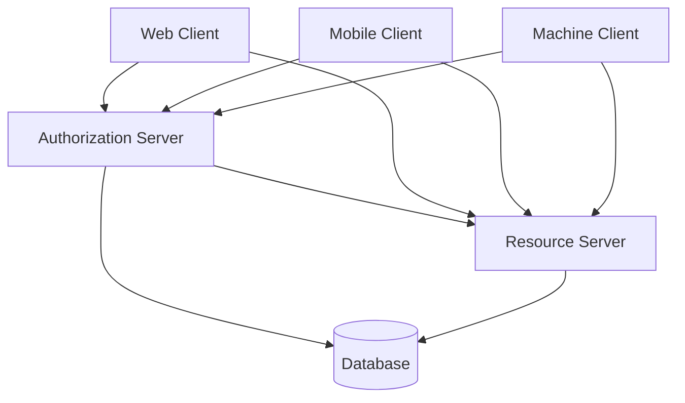

# 🔐 OAuth 2.0 Implementation Project - Complete Demo

Una implementación completa y educativa de todos los flujos OAuth 2.0, diseñada para explicar y demostrar los conceptos de autorización moderna.

## 📋 Tabla de Contenidos

- [Descripción](#-descripción)
- [Arquitectura](#-arquitectura)
- [Flujos Implementados](#-flujos-implementados)
- [Requisitos](#-requisitos)
- [Instalación](#-instalación)
- [Configuración](#-configuración)
- [Uso](#-uso)
- [Estructura del Proyecto](#-estructura-del-proyecto)
- [Endpoints API](#-endpoints-api)
- [Seguridad](#-seguridad)
- [Demostraciones](#-demostraciones)
- [Troubleshooting](#-troubleshooting)
- [Contribución](#-contribución)
- [Licencia](#-licencia)

## 🎯 Descripción

Este proyecto implementa **todos los flujos OAuth 2.0** definidos en el RFC 6749, proporcionando una plataforma educativa completa para entender:

- Autorización delegada segura
- Diferentes tipos de concesión (grant types)
- Mecanismos de seguridad (PKCE, state, scopes)
- Implementación de servidores de autorización y recursos
- Clientes para diferentes escenarios

## 🏗️ Arquitectura



## 🔄 Flujos Implementados

| Flujo | Tipo Cliente | Código | Seguridad | Caso de Uso |
|-------|-------------|---------|-----------|-------------|
| **Authorization Code** | Confidencial | ✅ | 🔐 | Aplicaciones web con backend |
| **Authorization Code + PKCE** | Público | ✅ | 🔐🔐 | SPAs, móviles, desktop |
| **Client Credentials** | Confidencial | ✅ | 🔐 | Machine-to-machine |
| **Refresh Token** | Todos | ✅ | 🔐 | Renovación de tokens |
| **Resource Owner Password** | Legacy | ✅ | ⚠️ | Migración (no recomendado) |

## ⚙️ Requisitos

### Software Requerido
- **Node.js** 18.0 o superior
- **npm** 9.0 o superior
- **MongoDB** 5.0 o superior
- **Redis** 6.0 o superior (opcional, para producción)

### Dependencias Principales
- Express.js - Servidores web
- MongoDB/Mongoose - Base de datos
- JWT - Tokens de acceso
- bcrypt - Hash de contraseñas
- crypto - Generación PKCE
- axios - Clientes HTTP

## 🚀 Instalación

### 1. Clonar el Repositorio
```bash
git clone https://github.com/tu-usuario/oauth2-complete-demo.git
cd oauth2-complete-demo
```

### 2. Instalar Dependencias
```bash
# Instalar todas las dependencias
npm run install:all

# O individualmente
cd authorization-server && npm install
cd ../resource-server && npm install
cd ../web-client && npm install
cd ../mobile-client && npm install
cd ../machine-client && npm install
```

### 3. Configurar Base de Datos
```bash
# Iniciar MongoDB (macOS con brew)
brew services start mongodb/brew/mongodb-community

# O con Docker
docker run -d -p 27017:27017 --name oauth-mongo mongo:5
```

### 4. Configurar Variables de Entorno
```bash
# Copiar plantillas
cp .env.example .env
cp authorization-server/.env.example authorization-server/.env
cp resource-server/.env.example resource-server/.env
```

## 🔧 Configuración

### Variables de Entorno Críticas

**authorization-server/.env**
```env
NODE_ENV=development
PORT=3001
MONGODB_URI=mongodb://localhost:27017/oauth_demo
JWT_SECRET=tu_jwt_secret_super_seguro_aqui
JWT_REFRESH_SECRET=tu_refresh_secret_aqui
CLIENT_ENCRYPTION_KEY=tu_clave_32_caracteres_aqui
FRONTEND_URL=http://localhost:3000
```

**resource-server/.env**
```env
NODE_ENV=development
PORT=3002
MONGODB_URI=mongodb://localhost:27017/oauth_demo
JWT_SECRET=tu_jwt_secret_super_seguro_aqui
AUTH_SERVER_URL=http://localhost:3001
```

### Configuración de Clientes OAuth

El sistema incluye clientes preconfigurados:

| Client ID | Tipo | Redirect URI | Scopes |
|-----------|------|--------------|---------|
| `web-client-123` | Confidencial | `http://localhost:3000/callback` | `profile email` |
| `mobile-client-456` | Público | `com.oauth.demo://callback` | `profile openid` |
| `machine-client-789` | Confidencial | N/A | `api:read api:write` |

## 🎮 Uso

### 1. Iniciar Todos los Servicios
```bash
# Desarrollo - inicia todos los servicios
npm run dev

# O individualmente
npm run start:auth    # Authorization Server (3001)
npm run start:resource # Resource Server (3002)
npm run start:web     # Web Client (3000)
npm run start:mobile  # Mobile Client (3003)
```

### 2. Acceder a las Demostraciones

| Servicio | URL | Descripción |
|----------|-----|-------------|
| **Web Client** | http://localhost:3000 | Cliente web completo |
| **Auth Server** | http://localhost:3001 | Servidor de autorización |
| **API Docs** | http://localhost:3001/api-docs | Documentación Swagger |
| **Mobile Demo** | http://localhost:3003 | Cliente móvil simulado |

### 3. Probar Flujos

#### Flujo Código de Autorización (Web)
1. Navegar a http://localhost:3000
2. Click "Login with OAuth"
3. Completar autenticación (usuario: `demo`, contraseña: `demo`)
4. Ver consentimiento y autorizar
5. Redirección automática con tokens

#### Flujo PKCE (Mobile)
```bash
cd mobile-client
npm run demo-pkce
```

#### Flujo Client Credentials (Máquina)
```bash
cd machine-client
npm run demo-machine
```

## 📁 Estructura del Proyecto

```
oauth2-complete-demo/
├── 📁 authorization-server/     # Servidor de autorización
│   ├── 📁 controllers/         # Lógica de endpoints
│   ├── 📁 models/              # Modelos de datos
│   ├── 📁 middleware/          # Autenticación, validación
│   ├── 📁 routes/              # Rutas API
│   ├── 📁 utils/               # JWT, PKCE, seguridad
│   └── server.js              # Servidor principal
├── 📁 resource-server/         # API de recursos protegidos
│   ├── 📁 middleware/          # Auth middleware
│   ├── 📁 routes/              # Recursos protegidos
│   └── server.js              # Servidor de recursos
├── 📁 web-client/              # Cliente web (Confidencial)
│   ├── 📁 public/              # Assets estáticos
│   ├── 📁 src/                 # Código frontend
│   └── server.js              # Servidor web
├── 📁 mobile-client/           # Cliente móvil (PKCE)
│   └── demo.js                # Demostración PKCE
├── 📁 machine-client/          # Cliente máquina-máquina
│   └── demo.js                # Demostración M2M
├── 📁 database/                # Scripts y modelos DB
├── 📁 docs/                    # Documentación adicional
└── 📁 scripts/                 # Scripts de utilidad
```

## 🌐 Endpoints API

### Authorization Server (3001)

| Método | Endpoint | Descripción |
|--------|----------|-------------|
| `GET` | `/authorize` | Iniciar flujo de autorización |
| `POST` | `/token` | Obtener tokens de acceso |
| `POST` | `/token/introspect` | Validar token |
| `POST` | `/token/revoke` | Revocar token |
| `GET` | `/userinfo` | Información de usuario (OIDC) |

### Resource Server (3002)

| Método | Endpoint | Scope Requerido |
|--------|----------|-----------------|
| `GET` | `/api/profile` | `profile` |
| `GET` | `/api/email` | `email` |
| `GET` | `/api/orders` | `orders:read` |
| `POST` | `/api/orders` | `orders:write` |

## 🔒 Seguridad

### Características Implementadas

- ✅ **PKCE** (Proof Key for Code Exchange)
- ✅ **State Parameter** (protección CSRF)
- ✅ **Validación estricta de redirect_uri**
- ✅ **Scopes y mínimo privilegio**
- ✅ **Tokens JWT firmados**
- ✅ **Refresh tokens rotativos**
- ✅ **CORS configurado correctamente**
- ✅ **Rate limiting básico**
- ✅ **Helmet.js para headers de seguridad**

### Mejores Prácticas Aplicadas

```javascript
// Ejemplo: Validación segura de redirect_uri
function validateRedirectUri(redirectUri, client) {
  const allowedUris = client.redirect_uris;
  const requestedUri = new URL(redirectUri);
  
  return allowedUris.some(allowed => {
    const allowedUrl = new URL(allowed);
    return allowedUrl.origin === requestedUri.origin &&
           allowedUrl.pathname === requestedUri.pathname;
  });
}
```

## 🎓 Demostraciones

### 1. Demostración de Flujo Completo
```bash
npm run demo:complete
```

### 2. Demostración de Seguridad PKCE
```bash
npm run demo:pkce
```

### 3. Demostración de Ataques y Protecciones
```bash
npm run demo:security
```

### 4. Casos de Uso Específicos

#### Integración con Red Social
```javascript
// Simulación "Login with Google"
const googleAuth = {
  client_id: 'web-client-123',
  scope: 'profile email',
  response_type: 'code',
  redirect_uri: 'http://localhost:3000/callback'
};
```

#### API Machine-to-Machine
```javascript
// Servicio a servicio
const token = await getClientCredentialsToken({
  client_id: 'service-account-1',
  client_secret: 'secret-key',
  scope: 'api:read api:write'
});
```

## 🐛 Troubleshooting

### Problemas Comunes

1. **MongoDB no conecta**
   ```bash
   # Verificar que MongoDB esté ejecutándose
   mongod --version
   brew services list
   ```

2. **Puertos ocupados**
   ```bash
   # Ver puertos en uso
   lsof -i :3000-3005
   
   # O matar procesos
   pkill -f node
   ```

3. **Error JWT Secret**
   ```bash
   # Generar nuevo secret
   node -e "console.log(require('crypto').randomBytes(64).toString('hex'))"
   ```

### Comandos de Diagnóstico

```bash
# Verificar salud de servicios
npm run healthcheck

# Ver logs en tiempo real
npm run logs:auth
npm run logs:resource

# Resetear base de datos
npm run db:reset
```

## 🤝 Contribución

### Estructura de Contribución

1. **Fork** el proyecto
2. **Feature Branch** (`git checkout -b feature/AmazingFeature`)
3. **Commit** los cambios (`git commit -m 'Add AmazingFeature'`)
4. **Push** al branch (`git push origin feature/AmazingFeature`)
5. **Abrir Pull Request**

### Guías de Estilo

- **Código:** Seguir ESLint configuration
- **Commits:** Conventional commits
- **Documentación:** Markdown con ejemplos prácticos
- **Tests:** Jest para unit tests, Supertest para APIs

## 📄 Licencia

Este proyecto está bajo la Licencia MIT - ver el archivo [LICENSE.md](LICENSE.md) para detalles.

## 🆘 Soporte

Si encuentras problemas o tienes preguntas:

1. 📖 Revisa la documentación en `/docs`
2. 🐛 Abre un issue en GitHub
3 💬 Únete a nuestro Discord de discusión
4. 📧 Contacta al maintainer: tu-email@dominio.com

---

## 🎯 Próximos Pasos

¿Listo para comenzar? Sigue estas instrucciones:

1. **Primeros Pasos**: `npm run setup:dev`
2. **Probar Demo**: `npm run demo:quickstart`  
3. **Explorar Código**: Revisa `web-client/src/` para ejemplos prácticos
4. **Modificar**: Experimenta cambiando scopes o flujos
5. **Aprender**: Usa los ejemplos para entender OAuth 2.0 en profundidad

**¡Feliz aprendizaje! 🚀**

---

<div align="center">

*¿Te sirvió este proyecto? ¡Dale una ⭐ en GitHub!*

**¿Preguntas?** Revisa los [issues](https://github.com/tu-usuario/oauth2-complete-demo/issues) o abre uno nuevo.

</div>